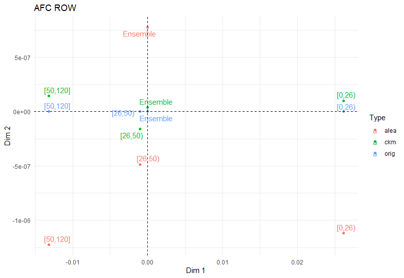
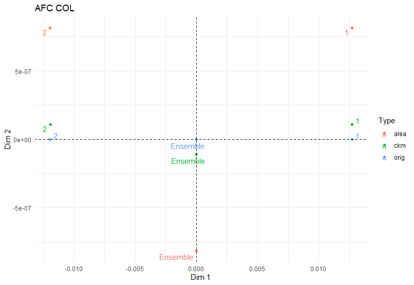
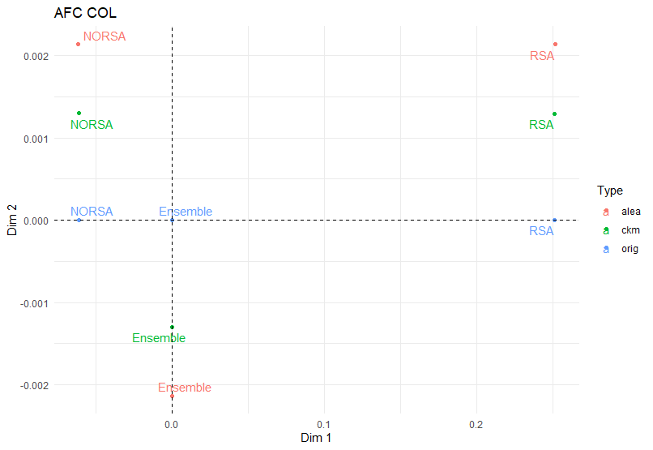
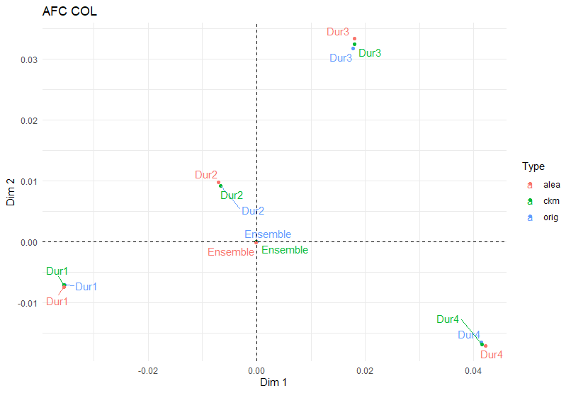
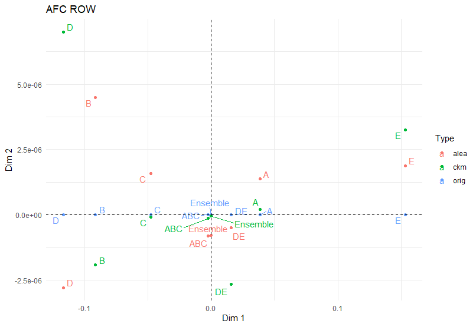

```{r setup, include=FALSE, cache=FALSE}
knitr::opts_chunk$set(echo = TRUE)
knitr::opts_knit$set(root.dir = getwd())
```

```{r message = FALSE,include=FALSE, warning=FALSE}
suppressPackageStartupMessages(library(data.table))
suppressPackageStartupMessages(library(ggplot2))
suppressPackageStartupMessages(library(ptable))
suppressPackageStartupMessages(library(cellKey))
suppressPackageStartupMessages(library(rtauargus))
suppressPackageStartupMessages(library(purrr))
suppressPackageStartupMessages(library(MASS))
suppressPackageStartupMessages(library(data.table))
suppressPackageStartupMessages(library(FactoMineR))
suppressPackageStartupMessages(library(tibble))
suppressPackageStartupMessages(library(dplyr))
suppressPackageStartupMessages(library(tidyr))
```


```{r chargement données, include=FALSE, cache=FALSE}
# source("Z:/Stage1A/fonctions/fonction_afc.R")
source("Z:/Stage1A/comparaison_ckm_alea.R")
```

# Introduction
Nous allons étudier la perte d'information de données perturbées par une Cell Key Method.


## Données utilisées

Pour faire notre analyse, nous avons à notre disposition des données Pôle Emploi regroupant 5 tableaux ayant chacun des spécificités différentes comme la catégorie, le quartier prioritaire, le sexe, la catégorie d'âge, le niveau de formation, la durée au chômage et si l'individu est au RSA. Une première présentation de ces données peut être faite comme suit :

```{r liste_tableaux, cache=FALSE}
str(liste_tableaux)
```


## Méthodes de perturbations des données

Nous allons ensuite appliquer la CKM et l'arrondi aleatoire à nos tableaux afin de pouvoir comparer les deux méthodes perturbatrices. Nous choisissons un arrondi aléatoire en base 10 et un variance de 6.25 et déviation de 10 pour la CKM. Les 5 tableaux ,contenant données originales et perturbées, sont présentés ici : 

```{r tableau_perturbe, echo=FALSE,  warning=FALSE}
tableau_perturbe <- appliquer_ckm(tableau_1, D, V)
tableau_perturbe <- appliquer_arrondi_aleatoire(tableau_perturbe, B)
library(DT)
DT::datatable(tableau_perturbe)
DT::datatable(tableau_perturbe_2)
DT::datatable(tableau_perturbe_3)
DT::datatable(tableau_perturbe_4)
DT::datatable(tableau_perturbe_5)

```

Après avoir appliquer les méthodes, notre objectif est de mesurer de différentes manières les conséquences de ces méthodes sur l'utilité des données, en comparant diverses métriques et analyses statistiques avant et après l'application de ces méthodes.

Pour cela, nous disposons d'une fonction qui, pour chaque sous-tableau et chaque méthode, va renvoyer le nombre de cellules du tableau, le nombre de cellules inférieures à 10, les distances moyennes par cellule, la distance de Hellinger et les distances relatives absolues. Nous avons également à notre disposition les tests de Spearman et Wilcoxon, le taux de variation de la variance ainsi que le V de Cramer et les statistiques associées.

```{r resultats, eval=FALSE}
resultats <- calculer_statistiques_sous_tableaux(tableau_perturbe, vars_cat, "nb_obs", "nb_obs_ckm", "nb_obs_alea", "Ensemble")
statistiques <- resultats$statistiques

```

Pour visualiser les conséquences de ces méthodes sur l'utilité des données, nous réalisons également des Analyses factorielles des correspondances (AFC) et des graphiques représentant la distance en fonction du nombre de cellules du tableau.


```{r visualisations, eval=FALSE}
plot_afc <- resultats$afc
plot_distances <- resultats$plot_distances

```


## Mesures d'utilité des données pour les méthodes CKM et Arrondi aléatoire

Une première statistique intéressante concerne le nombre d'observations inférieures à 10 :


```{r statistique, cache=FALSE}
library(DT)
DT::datatable(all_statistiques %>% select(Tableau,Taille, Nb_obs_inf_10, Nb_obs_inf_10_ckm, Nb_obs_inf_10_alea))

```
Pour la méthode CKM, cette statistique semble être respectée dans tous les cas possibles, indépendamment de la taille du tableau, avec un nombre d'observations inférieures à 10 proche de celui originale. En revanche, pour l'arrondi aléatoire, on observe que le nombre d'observations inférieures à 10 est plus que divisé par deux.

Il est important de noter que cette statistique ne nous permet pas de déterminer si ce sont les mêmes cellules qui restent en dessous de 10 ou si cela varie.


### Mesurer la distorsion des distributions

Dans cette section, nous allons nous interresser aux distances entre les cellules originales et  perturbées. Nous nous focaliserons sur deux distances : la distance absolue moyenne par cellule et la distance de Hellinger.

Soit \(D_k\) représentant un tableau pour l'observation \(k\) et \(D_k(c)\) la fréquence de la cellule \(c\) dans le tableau. Soit \(n\) le nombre total de cellules. Les métriques de distance sont :

##### Distance de Hellinger

\[ 
HD(D_{\text{orig}}, D_{\text{pert}}) = \frac{1}{n} \sum_{k=1}^{n} \sqrt{ \frac{1}{2} \left( \sqrt{D_{k,\text{pert}}(c)} - \sqrt{D_{k,\text{orig}}(c)} \right)^2 }
\]

##### Distance Absolue Moyenne par Cellule

\[ 
AAD(D_{\text{orig}}, D_{\text{pert}}) = \frac{1}{n} \sum_{k=1}^{n} \left| D_{k,\text{pert}}(c) - D_{k,\text{orig}}(c) \right|
\]


La distance HD est basée sur la théorie de l'information. Elle est fortement influencé par les petites cellules.
L'AAD est plus intuitif et décrit la différence absolue moyenne par cellule.
Les tableaux suivant présente les résultats des mesures d'utilité pour les différentes méthodes SDC.

Pour la distance moyenne par cellule, on a :

```{r, echo=FALSE}
DT ::datatable(all_statistiques %>% select(Tableau,Taille, AAD_ckm,AAD_alea))  %>%formatRound(columns = c('AAD_ckm', 'AAD_alea'), digits = 1)
```

Que l'on peut représenter sur un graphique :

```{r, echo=FALSE}
ggplot(all_statistiques) +
  geom_point(aes(x = Taille, y = AAD_ckm, color = 'AAD_ckm')) +
  geom_point(aes(x = Taille, y = AAD_alea, color = 'AAD_alea')) +
  labs(title = "Distance en fonction du nombre de cellules",
       x = "Nombre de cellules",
       y = "Distances moyenne par cellules",
       color = "Légende") +
  theme_bw()


```


On constate que la distance moyenne par cellule ne depasse pas 2.5 pour la CKM qui a une déviation de 10 et est aux moins deux fois moins élevée que celle pour l'arrondi aléatoire allant jusqu'à 5. Pour la CKM, les valeurs des cellules perturbées sont donc très proches des valeurs originales. La méthode  conserve bien les valeurs des cellules, ce qui est important pour maintenir l'utilité des données pour des analyses précises.


Pour la distance de Hellinger on a : 

```{r, echo=FALSE}
 DT ::datatable(all_statistiques %>% select(Tableau,Taille, HD_ckm,HD_alea))%>%formatRound(columns = c('HD_ckm', 'HD_alea'), digits = 4)
```


Que l'on peut representer : 

```{r, echo=FALSE}
ggplot(all_statistiques) +
  scale_x_log10()+
  geom_point(aes(x = Taille, y = HD_ckm, color = 'HD_ckm')) +
  geom_point(aes(x = Taille, y = HD_alea, color = 'HD_alea')) +
  labs(title = "Distance en fonction du nombre de cellules",
       x = "Nombre de cellules\n(ech log)",
       y = "Distances Hellinger",
       color = "Légende") +
  theme_bw()
```


D'apres le tableau et le graphique, on remarque que les distances de Hellinger sont proches de 0 pour la CKM. Les distributions des données originales et perturbées sont donc très similaires, ce qui signifie que les propriétés statistiques globales des données sont bien conservées. Par conséquent, l'utilité des données pour des analyses basées sur des distributions reste élevée. De plus, la distance de Hellinger est deux fois moins élevée pour la méthode CKM comparée à l'arrondi aléatoire, soulignant ainsi la meilleure conservation des distributions par la méthode CKM.


### Impact sur les mesures d'association

#### La statistique du V de Cramer 

Une autre analyse statistique fréquemment réalisée sur les tableaux de contingence est le test d'indépendance entre les variables catégorielles qui composent le tableau. Le test d'indépendance pour un tableau à deux entrées est basé sur une statistique du Chi-deux de Pearson :

\[ 
\chi^2 = \sum_i \sum_j \frac{(o_{ij} - e_{ij})^2}{e_{ij}}
\]

où \(o_{ij}\) est le nombre observé et \(e_{ij} = \frac{n_{i.} \times n_{.j}}{n}\) est le nombre attendu pour la ligne \(i\) et la colonne \(j\). Si les lignes et les colonnes sont indépendantes, alors \(\chi^2\) suit asymptotiquement une distribution du chi-deux avec \((R-1)(C-1)\) degrés de liberté. Pour des valeurs élevées, le test rejette l'hypothèse nulle en faveur de l'hypothèse alternative d'association.


Le V de Cramer est une mesure pour évaluer la force de l’association entre deux variables catégorielles. Issu de la statistique du chi carré, ce coefficient fournit une valeur normalisée comprise entre 0 et 1, où 0 indique aucune association et 1 signifie une relation parfaite. Il est définit comme :

\[ 
CV = \sqrt{\frac{\chi^2}{n \cdot \text{min}(R-1, C-1)}}
\]

et nous définissons la perte d'information par la différence relative en pourcentage entre le tableau original et le tableau perturbé :

\[ 
RCV(D_{\text{orig}}, D_{\text{pert}}) = 100 \times \frac{CV(D_{\text{pert}}) - CV(D_{\text{orig}})}{CV(D_{\text{orig}})}
\]

Le tableau suivant présente les mesures de perte d'information \(RCV\) pour nos données Pôle emploie :

```{r, echo=FALSE}
 DT ::datatable(all_statistiques %>%drop_na() %>% select(Tableau,Taille, Taux_Variation_V_Cramer_ckm,Taux_Variation_V_Cramer_alea ))%>%formatRound(columns = c('Taux_Variation_V_Cramer_ckm', 'Taux_Variation_V_Cramer_alea'), digits = 4)
```
```{r}
# all_statistiques %>%
#   drop_na() %>%
#   select(Tableau,Taille, Taux_Variation_V_Cramer_ckm,Taux_Variation_V_Cramer_alea )%>%
#   knitr::kable(format="latex", digits = 4)
```

D'une part, la CKM indiquent que les tableaux ayant un petit nombre de cellules subissent une légère perte d'association contrairement à l'arrondi aléatoire qui subie une légère hausse d'association.

D'autre part, les deux méthodes indiquent que les tableaux perturbés ont artificiellement plus d'associations que le tableau d'origine si le tableau comporte beaucoup de cellules et d'autant plus dans le cas de l'arrondi aléatoire. Les tableaux contenant la variable PLGQP sont particulièrement affecté . 


A noter que ce résultat est independant du nombre de cellules inférieure à 10 dans les tableaux.


#### L'Analyse factorielle des correspondances (AFC) 

L’analyse factorielle des correspondances (AFC) est une méthode exploratoire d’analyse des tableaux de contingence. L’AFC est considérée comme une ACP particulière dotée de la métrique du \(\chi^2\) qui ne dépend que du profil des colonnes du tableau. L’analyse permet, dans le plan des deux premiers axes factoriels, une représentation simultanée des ressemblances entre les colonnes ou les lignes du tableau et de la proximité entre lignes et colonnes.

Nous présentons ci-dessous 5 AFC réalisées sur nos tableaux.


Pour nos trois premiers tableaux, nous avons l'âge pour le premier, le sexe pour le deuxième et le RSA pour le troisième.

```{r}
DT ::datatable(resultats_2$tab_orig$AGE3c_SEXE)
DT ::datatable(resultats_2$tab_pert_ckm$AGE3c_SEXE)
DT ::datatable(resultats_2$tab_pert_alea$AGE3c_SEXE)
```


```{r, echo=FALSE, fig.cap="AFC sur AGE3c", , fig.align='center'}
library(knitr)

```


```{r echo=FALSE, fig.cap="AFC sur SEXE", , fig.align='center'}

```


```{r}
DT ::datatable(resultats_5$tab_orig$PLGQP_RSA)
DT ::datatable(resultats_5$tab_pert_ckm$PLGQP_RSA)
DT ::datatable(resultats_5$tab_pert_alea$PLGQP_RSA)
```


```{r echo=FALSE, fig.cap="AFC sur RSA", , fig.align='center'}

```

Sur nos AFC, nous pouvous faire des analyses visuelles. En effet, on observe que globalement, dans toutes les AFC possibles, les points de la CKM sont très proches de ceux de l'original et nettement meilleurs que ceux de l'arrondi aléatoire. On peut donc conclure que la CKM conserve bien les ressemblances entre les colonnes et les lignes du tableau original, offrant ainsi une meilleure utilisation des données.

Pour nos deux tableaux suivants, nous avons la durée au chômage pour le premier et la catégorie de l'individu pour le deuxième.

```{r, echo=FALSE}
DT ::datatable(resultats_4$tab_orig$PLGQP_DUR)
DT ::datatable(resultats_4$tab_pert_ckm$PLGQP_DUR)
DT ::datatable(resultats_4$tab_pert_alea$PLGQP_DUR)


```

```{r echo=FALSE, fig.cap="AFC sur DUR",, fig.align='center'}

```


```{r, echo=FALSE}
DT ::datatable(resultats$tab_orig$CATEG_SEXE)
DT ::datatable(resultats$tab_pert_ckm$CATEG_SEXE)
DT ::datatable(resultats$tab_pert_alea$CATEG_SEXE)
```


```{r echo=FALSE, fig.cap="AFC sur CATEG", , fig.align='center'}

```


On peut constater qu'il arrive que les points des tableaux originaux et perturbés, quelle que soit la méthode utilisée, se superposent. Parfois, l'arrondi aléatoire présente même des points plus proches du tableau original que la CKM. On remarque que cela arrive lorsque la variable à beaucoup de modalitées.


### Tests d'hypothèses statistiques pour détecter les biais
#### Test de Spearman

Un autre outil d'inférence statistique est la corrélation de rang de Spearman. Il s'agit d'une technique qui teste la direction et la force de la relation entre deux variables. La statistique est basée sur le classement des deux variables de la plus élevée à la plus basse et sur le calcul d'une statistique de corrélation. Une évaluation importante pour analyser l’impact des méthodes SDC sur les données statistiques consiste à vérifier si le classement des valeurs au sein des variables est faussé. Dans le cadre de la comparaison entre le tableau original (nb_obs) et le tableau perturbé (nb_obs_ckm ou nb_obs_alea), le test de Spearman permet d'évaluer si la structure des rangs des données est maintenue après perturbation.


```{r, echo=FALSE}
DT::datatable(all_statistiques %>% select(Tableau,Taille, rho_Spearman_ckm, rho_Spearman_alea,p_value_Spearman_ckm, p_value_Spearman_alea))%>%formatRound(columns = c('rho_Spearman_ckm', 'rho_Spearman_alea', 'p_value_Spearman_ckm', 'p_value_Spearman_alea'), digits = 3)
```

```{r}
# all_statistiques %>% select(Tableau,Taille, rho_Spearman_ckm, rho_Spearman_alea) %>% 
#   arrange(desc(rho_Spearman_ckm)) %>% 
#   slice(1:10) %>% 
#   knitr::kable(format="latex", digits = 3, booktabs=TRUE, caption= "Test de Spearman")
```

Une valeur de rho proche de 1 indique une forte corrélation. Cela signifie que les rangs des données originales et perturbées sont fortement liés. Alors qu'Une valeur de rho proche de 0 indique une faible corrélation, ce qui suggère que la perturbation a modifié la structure des rangs des données.

Si la valeur p est supérieure à 0.05, on ne peut pas rejeter l'hypothèse nulle. Cela signifie qu'il n'y a pas de preuve statistiquement significative de corrélation entre les deux ensembles de données. alors que Si la valeur p est inférieure ou égale à 0.05, on rejette l'hypothèse nulle. Cela signifie qu'il y a une preuve statistiquement significative de corrélation entre les deux ensembles de données.

Dans le cas de petit tableau (nb de cellules<5) et pour les deux méthodes, la p valeur est supérieur à 0.05 et donc on en conclue qu'il n'y a pas de prevue significative de corrélation entre les deux ensembles de données (originale et perturbéé)

Sinon, les valeur rho sont toujours très proche de 1 peu importe la méthode et la valeur de p inférieur à 0.05. On remarque que la ckm est toujours meilleurs que l'arrondi aléatoire si on compare leurs valeurs de rho.


#### Test de Wilcoxon

Nous pouvons aussi utiliser un test de classement signé de Wilcoxen pour vérifier si l'emplacement de la distribution empirique a changé. L'hypothèse nulle du test est la suivante : aucun changement. La statistique standardisée est basée sur le classement des cellules dans le tableau et tester si la somme des scores de classement pour les cellules d'origine dévie de la moyenne attendue sous l’hypothèse nulle d’égalité de localisation. S'il y a un grand écart (petite valeur p), alors on peut dire que l'emplacement de la distribution a été décalé. Le tableau suivant présente les valeurs p pour le test de classement signé de Wilcoxon.

```{r, echo=FALSE}
DT ::datatable(all_statistiques %>% select(Tableau,Taille,p_value_Wilcoxon_ckm, p_value_Wilcoxon_alea))%>%formatRound(columns = c('p_value_Wilcoxon_ckm', 'p_value_Wilcoxon_alea'), digits = 3)
```

```{r}
# all_statistiques %>% select(Tableau,Taille,p_value_Wilcoxon_ckm, p_value_Wilcoxon_alea) %>% 
#   arrange(p_value_Wilcoxon_ckm) %>% 
#   slice(1:10) %>% 
#   knitr::kable(format="latex", digits = 3, booktabs=TRUE, caption= "Test de Wilcoxon")
```


La table montre que les perturbations ont modifié la distribution des données sur les tableaux comportant un très grand nombre de cellules (>100 000) et un grand nombre de petites cellules (>40 000). Ce phénomène est particulièrement prononcé dans le cas de la méthode CKM, qui présente des p-values inférieures à 0,05 et plus basses que celles de l'arrondi aléatoire, indiquant ainsi une perturbation plus importante de la distribution des données.

Les autres tableaux ont une p valeur supérieur à 0.05 et on en conclut que les perturbations n'ont pas modifié significativement la distribution des données. De plus, les p-value de la CKM sont plus élevée que celle de l'arrondi aléatoire. Cela suggére que les perturbations effectuées par la CKM sont meilleures en termes de conservation d'utilité.


### Impact sur la variance des estimations

Les méthodes SDC auront un impact sur les variances calculées pour les estimations basées sur les
tableaux de fréquence. Nous examinons la variance du nombre de cellules  avant et après les méthodes SDC en calculant le taux de variation de variance.

```{r, echo=FALSE}
DT ::datatable(all_statistiques %>% select(Tableau,Taille,Taux_Variation_Variance_ckm, Taux_Variation_Variance_alea)) %>% formatRound(columns = c('Taux_Variation_Variance_ckm', 'Taux_Variation_Variance_alea'), digits = 4)
```
Pour tous les tableaux, on remarque le taux de variation de variance est très faible pour les deux méthodes et que la CKM a toujours un taux de variation plus faible et donc conserve mieux la dispersion des données. L'arrondi aleatoire qui a des taux de variation négatif produit des comptes cellulaires plus uniformes.


# Discussion

De cette analyse, il ressort clairement que la CKM, en tant que méthode perturbatrice, est globalement meilleure que l'arrondi aléatoire en termes d'utilité des données. Cela est confirmé par plusieurs critères : la conservation du nombre de petites cellules, les distances entre les données originales et perturbées, l'impact sur les mesures d'association avec le V de Cramer et les AFC, les tests de Spearman et Wilcoxon, ainsi que l'impact sur l'estimation de la variance.

Les principaux impacts des méthodes SDC en matière de perte d’informations dépendent du type de tableau et quelques lignes directrices générales ont émergé :

- Les tableaux ayant un petit nombre de cellules subissent une légère perte d'association pour la CKM, contrairement à l'arrondi aléatoire qui subit une légère hausse d'association. De plus, on observe qu'il n'y a pas de preuve significative de corrélation entre les deux ensembles de données (originales et perturbées).

- Les tableaux ayant un grand nombre de cellules voient pour les deux méthodes une hausse d'associations. De plus, on observe que les perturbations ont modifié la distribution des données, surtout pour la CKM.

- Dans le cas de variables ayant beaucoup de modalités, l'arrondi aléatoire présente des points plus proches du tableau original que la CKM dans les AFC. Toutefois, dans tous les autres cas, la CKM a des points bien plus proches de ceux originaux et est nettement meilleure que l'arrondi aléatoire.


