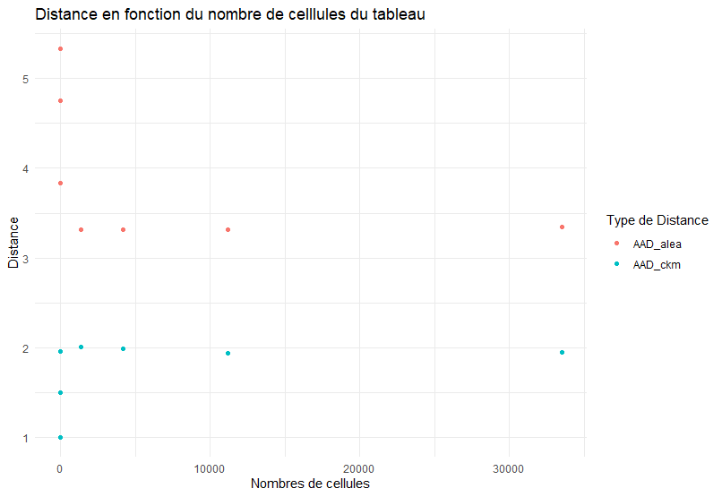

```{r setup, include=FALSE}
knitr::opts_chunk$set(echo = TRUE)
knitr::opts_knit$set(root.dir = getwd())
```

```{r message = FALSE,include=FALSE, warning=FALSE}
suppressPackageStartupMessages(library(data.table))
suppressPackageStartupMessages(library(ggplot2))
suppressPackageStartupMessages(library(ptable))
suppressPackageStartupMessages(library(cellKey))
suppressPackageStartupMessages(library(rtauargus))
suppressPackageStartupMessages(library(purrr))
suppressPackageStartupMessages(library(MASS))
suppressPackageStartupMessages(library(data.table))
suppressPackageStartupMessages(library(FactoMineR))
suppressPackageStartupMessages(library(tibble))
suppressPackageStartupMessages(library(dplyr))
suppressPackageStartupMessages(library(tidyr))
```


```{r chargement données, include=FALSE, cache=TRUE}
# source("Z:/Stage1A/fonctions/fonction_afc.R")
source("Z:/Stage1A/comparaison_ckm_alea.R")
```

# Introduction
Nous allons étudier la perte d'information de données perturbées par une Cell Key Method.


## Chargement des données

Pour faire notre analyse, nous avons à notre disposition des données Pôle Emploie original regroupant 5 tableaux ayant chacun des spécificités différentes comme la catégorie, le quartier prioritaire, le sexe, la catégorie d'age, le niveau de formation, dur et si l'individu est au RSA. Une premiere présentation de ces données peut être faite comme suit:  

```{r liste_tableaux}
str(liste_tableaux)
```


## Applications des méthodes 

Nous allons ensuite appliquer la CKM et l'arrondi aleatoire a nos tableaux affin de pouvoir comparer les deux méthodes perturbatrices. Un exemple pour le premier tableau est présenté ici : 

```{r tableau_perturbe, eval=FALSE}

tableau_perturbe <- appliquer_ckm(tableau_1, D, V)
tableau_perturbe <- appliquer_arrondi_aleatoire(tableau_perturbe, B)
```
```{r}
str(tableau_perturbe)
```


## Applications fonctions 

Après avoir appliquer les méthodes, notre objectif est de mesurer de différentes manières les conséquences de ces méthodes sur l'utilité des données, en comparant diverses métriques et analyses statistiques avant et après l'application de ces méthodes.

Pour cela, nous disposons d'une fonction qui ,pour chaque sous tableaux et chaque méthodes, va renvoyer le nombre de cellules du tableaux, le nombre de cellules inférieur à 10, les distances moyennes par cellules, d'Hellinger et relatives absolues. Mais aussi les test de Spearman et Wilcoxon, le taux de variation de variance et le V de cramer et statistiques associées.  

```{r resultats, eval=FALSE}
resultats <- calculer_statistiques_sous_tableaux(tableau_perturbe, vars_cat, "nb_obs", "nb_obs_ckm", "nb_obs_alea", "Ensemble")
statistiques <- resultats$statistiques

```

Pour visualiser les conséquences de ces méthodes sur l'utilité des données, nous réalisons également des Analyse factorielle des correspondances (AFC) et des graphiques représentant la distance en fonction du nombre de cellules du tableau.


```{r visualisations, eval=FALSE}
plot_afc <- resultats$afc
plot_distances <- resultats$plot_distances

```

## Comparaison CKM et Arrondi Aléatoire 

Dès lors nous pouvons afficher notre tableau avec nos statistiques afin de les évaluer :


```{r statistique}
library(DT)
DT::datatable(statistiques)

```

Intérressons nous plus précisement aux distances :


```{r, echo=FALSE}
DT ::datatable(statistiques %>% select(Tableau,Taille, AAD_ckm,AAD_alea))
```

Que l'on peut représenter sur un graphique :

```{r, echo=FALSE}
library(knitr)



```


